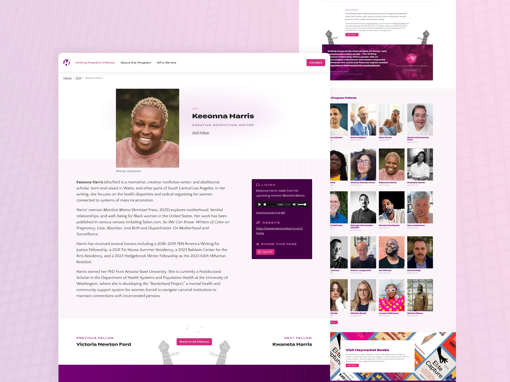
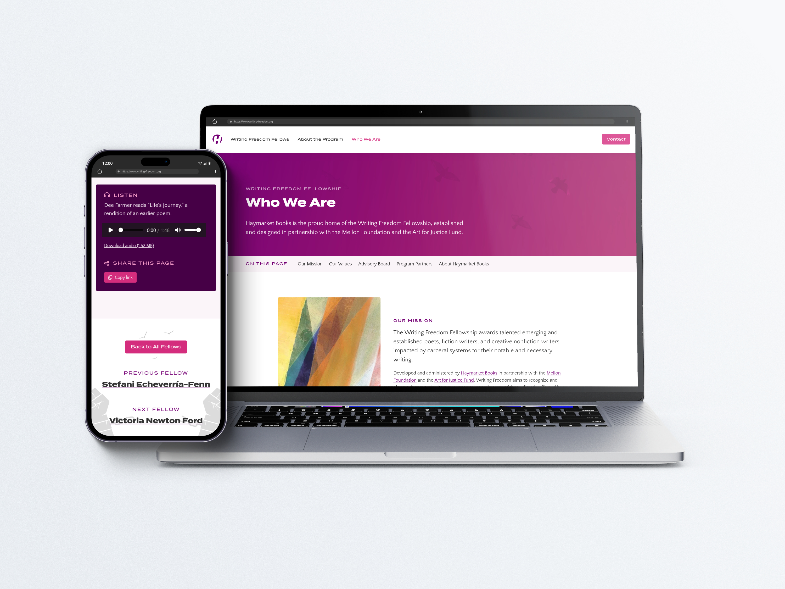

import TextCallout from "../../components/mdx/TextCallout.astro";

## Overview

[Haymarket Books](https://www.haymarketbooks.org/) is an independent publisher based in Chicago that features the work of socially- and politically-engaged writers such as Howard Zinn, Angela Y. Davis, and Keeanga-Yamahtta Taylor.

The [Writing Freedom Fellowship](https://writing-freedom.org/) is a new Haymarket initiative (in partnership with the Mellon Foundation and the Arts for Justice Fund) that highlights poets, fiction writers, and non-fiction writers impacted by carceral systems. I was honored to design and build the accompanying standalone website for this important arts-based non-profit program.

## Centering the Fellows

The most important objective of this site is to showcase the 20 individuals awarded the fellowship each year. To encourage exploration of the fellows’ stories and facilitate sharing them across platforms, the site’s structure was designed to lead to individual pages for each fellow, where users can read biographies and hear audio clips of fellows reading from their works.

The site is fully editable with a customized [Sanity Studio content management dashboard](https://www.sanity.io/studio). Reusable content schemas means site editors can easily add new fellows as the programs grows each year.

<TextCallout
    content="The live site not only makes it easy to discover and share profiles of fellows, but it also delivers a seamless editing experience for site editors."
    centered
/>

## Aligning Form and Function

With the custom design of the site, I sought to capture the vibrancy, depth, and hopefulness of the program’s activist and social justice influences. The bold [Termina typeface](https://fortfoundry.com/fonts/termina) lends a sense of significance and excitement to the message, while the pastel colors and winged imagery evoke the possibility of transformation.

The site was built with the [Astro framework](https://astro.build/) to deliver a minimal, lightweight end product, with just a dash of animation added in to make for a more pleasant user experience. Prioritizing simplicity means virtually no maintenance or time spent fixing plugins or bugs, just a focus on the site’s message itself.
