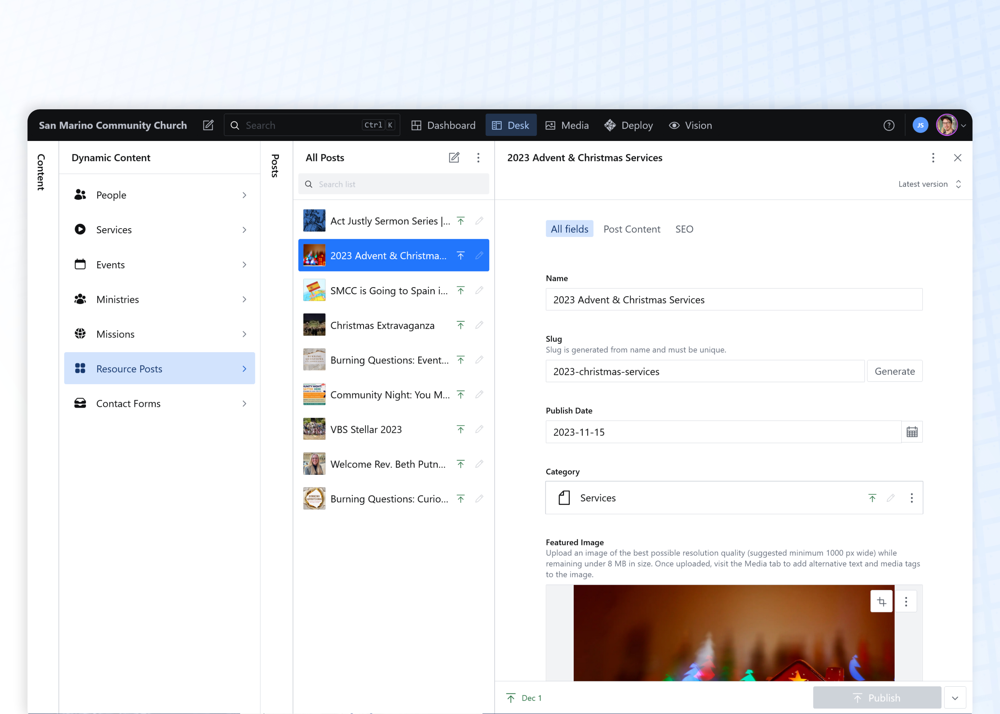
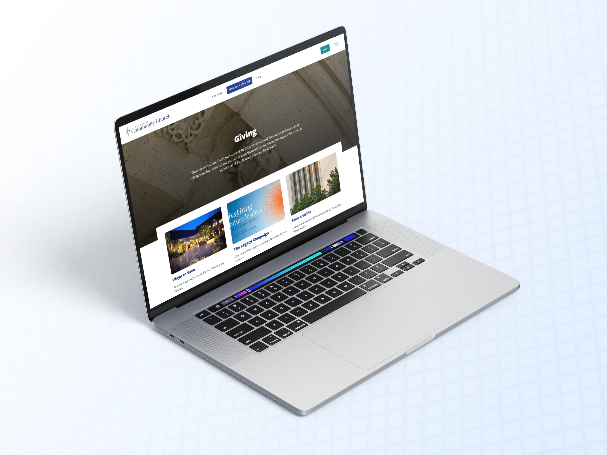

import TextCallout from "../../components/mdx/TextCallout.astro";

## Overview

[San Marino Community Church](https://sanmarinocommunitychurch.com/) (SMCC) is a large, multi-generational church with many programs and events happening every week. When they reached out to me for a website redesign, they felt that their then-current platform—a confusing proprietary platform managed by a large, faceless company—did not meet their needs for custom content management or meaningful design.

I took on this project not just to refresh the visual design of the website, but to help SMCC deeply rethink how the site’s content itself could be restructured to fit the needs of this growing community.

## A Fully Customized Content Management Experience

In working with SMCC, we identified the crucial building blocks of content that were most important for the site—recurring types like events, services, ministries, resources, and people—and developed custom, reusable content templates for each group. Within a [Sanity Studio content management dashboard](https://www.sanity.io/studio), site editors can easily update and add new content items, which allows the site to grow over time.

Unlike a more traditional content management system such as WordPress, which forces all content to be conceived as either _pages_ or _posts_, these reusable “atoms” of content gave us much greater freedom in structuring and reusing elements across the site.

The result is a dynamic site of more than 200 pages, which features a broad range of content types that are editable from a single source. The site is easily traversed through a main super-menu, as well as numerous contextual submenus and sidebar links.

<TextCallout
    content="We ultimately solved one of SMCC’s major pain points by moving from a rigid, expensive backend system to a flexible, extensible, and low-cost alternative."
    centered
/>

