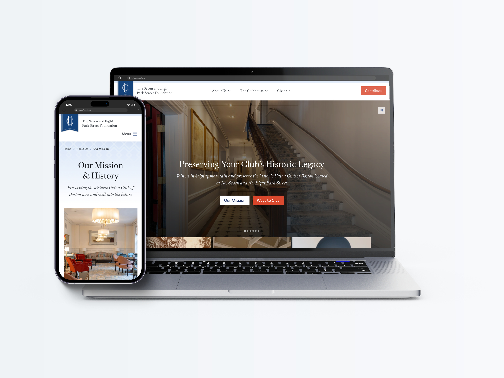
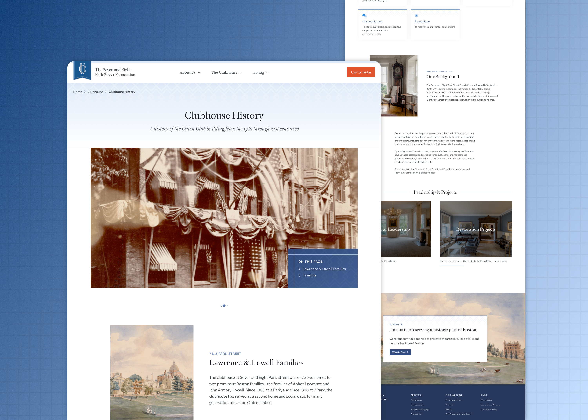

import TextCallout from "../../components/mdx/TextCallout.astro";

## Overview

The Seven and Eight Park Street Foundation is the preservation and fundraising arm of the historic building housing the Union Club of Boston. The Foundation approached me for a long-overdue rehabilitation of a website that was more than a decade old.

Amazingly, the site still worked (a testament to the resilience of well-structured HTML), but it was time for a refresh. The Foundation brought me a list of core functionalities and objectives that would make the site a success, the most important being the ability for users to donate online.

We implemented all of the objectives and more through a [Statamic-based website](/services#statamic) and content management system.

## A Donor-Friendly Site

I worked with the Foundation to develop a content plan and visual style that would do more than simply convey updated information; rather, the site was an opportunity to tell a more compelling narrative about the Union Club's unique place in Boston's history.

The resulting site is user friendly and informative, with sections on historical background, current restoration projects, annual events, and ways of giving, all of which serve to draw in potential supporters to the Foundation's mission.

Finally, I helped the team set up an online donation integration that enables site visitors to contribute directly from the website.

<TextCallout content="All parts of the site work together to communicate the Foundation’s mission and to direct users to numerous ways of giving." />

## A Design Inspired by History

The subject of the site offered the unique chance to pull in local historical elements as a part of the overall look and feel. I researched and sourced numerous public domain images from the Massachusetts Digital Commonwealth collection to use throughout the site, including maps and illustrations of Boston Common.

These elements lend the site an authority and credibility that complement the messaging.

