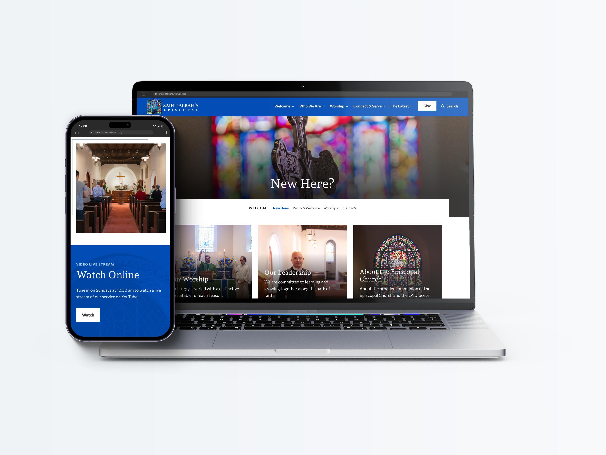
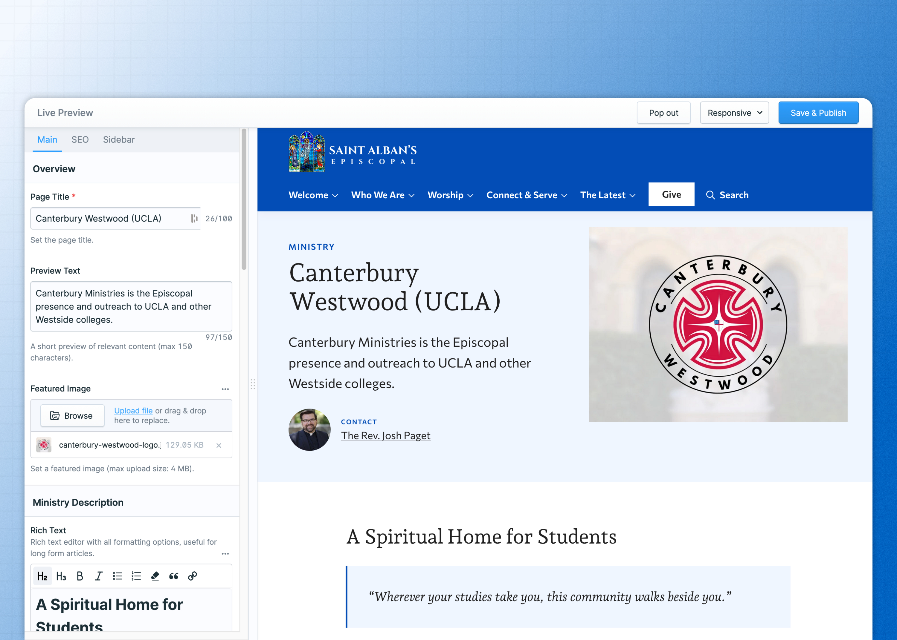
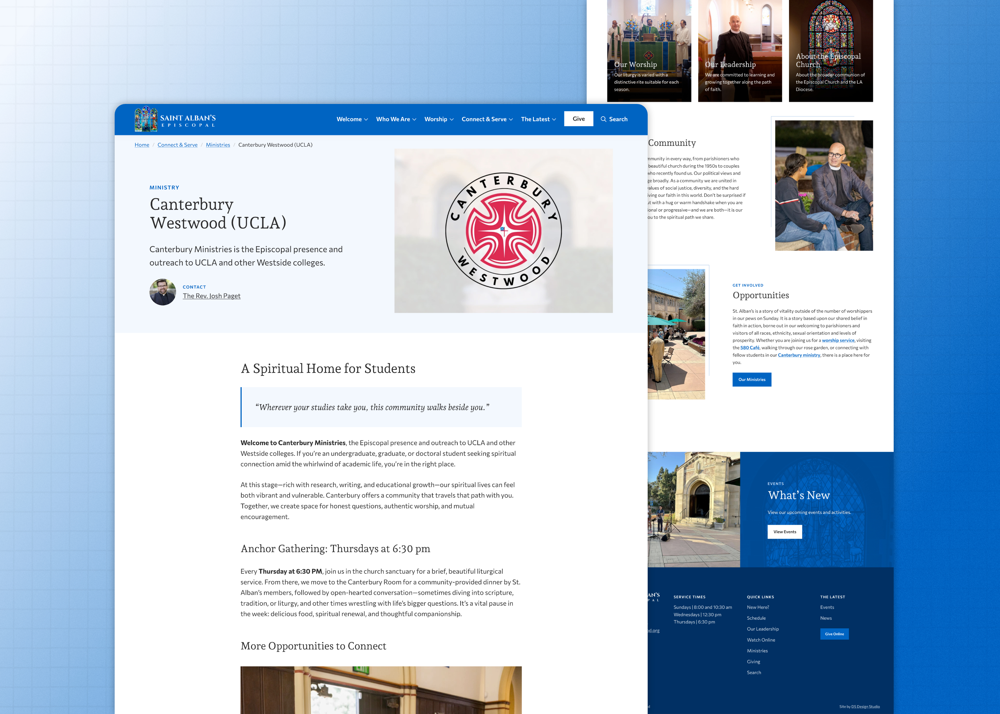

import TextCallout from "../../components/mdx/TextCallout.astro";

## Overview

St. Alban’s is an Episcopal church directly across the street from the campus of the University of California, Los Angeles (UCLA), in L.A.'s Westwood neighboorhood. Given this prime location, campus outreach and student ministry is an incredibly important part of St. Alban's mission.

Before I redesigned their site, St. Alban's was stuck with an outdated and buggy WordPress site that was difficult to update for various reasons. Because of this, they were missing out on the full power of a dynamic, up-to-date website, which is an invaluable outreach tool.

I worked with St. Alban's to transfer their site content and backend platform from WordPress to [Statamic](/services#statamic), my preferred next-generation CMS, which greatly enhanced the overall performance and administration of the site.

<TextCallout content="With Statamic’s intuitive control panel and custom content collections, we were able to build a flourishing, robust site that is much easier for editors to maintain." />

## A Welcoming Online Home

The core mission of St. Alban’s revolves around ideas of "welcome" and "belonging," directed especially to the nearby student population. One of the main goals for the website was thus to mirror this language in form and aesthetics, making content easy to navigate, accessible to all users, and approachable.

For the visual design, I sought to strike a balance between elegance and friendliness to try to communicate that sense of open welcomeness.

